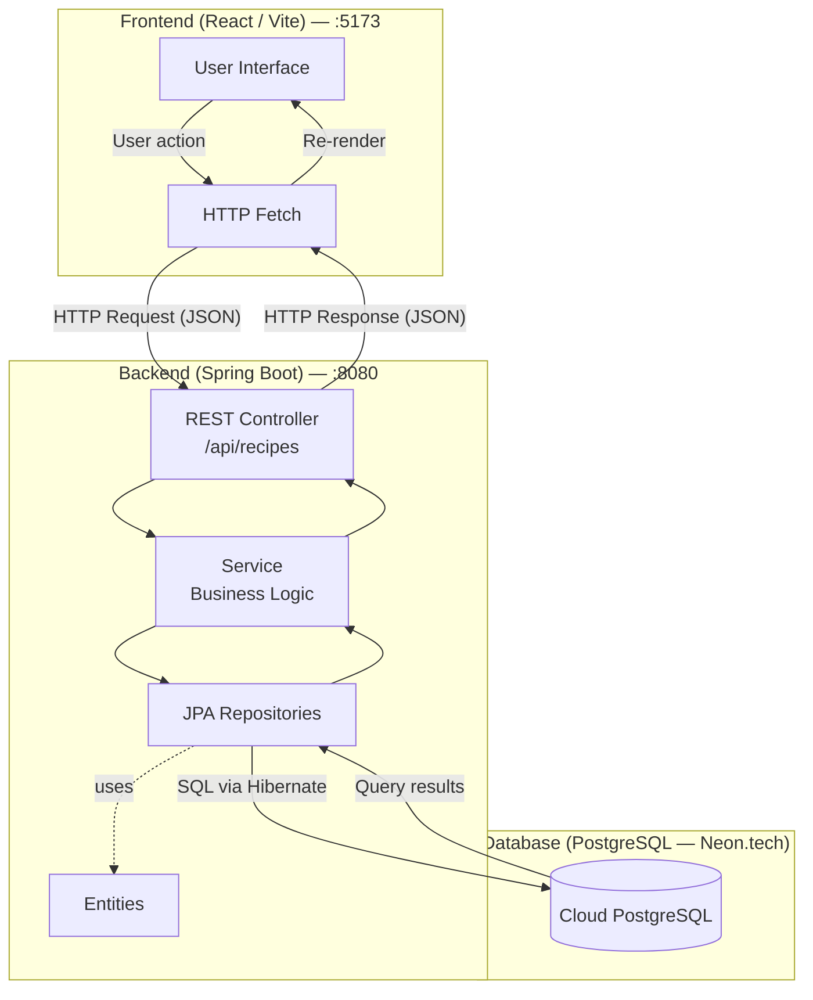

# 📖 Project Receptář

**Receptář** is a full-stack recipe management web application built as a school project at Ostravská Univerzita. It allows users to browse and create recipes with a structured ingredient list. The backend exposes a REST API powered by Spring Boot and PostgreSQL, while the frontend is a modern React + TypeScript SPA styled with Tailwind CSS.

---

## 🛠️ Tech Stack

| Layer      | Technology                                            |
|------------|-------------------------------------------------------|
| Backend    | Java 25, Spring Boot 4.0.5, Spring Web MVC            |
| Database   | PostgreSQL ([Neon.tech](https://neon.tech/)) + Spring Data JPA + Hibernate |
| Validation | Spring Validation                                     |
| Build      | Maven (Maven Wrapper included)                        |
| Utilities  | Lombok, Spring Boot DevTools                          |
| Frontend   | React 19, TypeScript, Vite, Tailwind CSS 4            |
| Routing    | React Router DOM 7                                    |

---

## 📂 Project Structure

> **Note:** The backend source root is `src/main/backend/java/` instead of the Maven default `src/main/java/`. This is a project-specific layout choice; the build is configured accordingly in `pom.xml`.

```
project-receptar/
├── frontend/                        # React + Vite frontend application
│   ├── src/
│   │   ├── components/
│   │   │   └── Navbar.tsx           # Navigation bar
│   │   ├── pages/
│   │   │   ├── RecipeList.tsx       # Homepage — lists all recipes
│   │   │   └── RecipeForm.tsx       # Form to create a new recipe
│   │   ├── types/
│   │   │   └── index.ts             # Shared TypeScript types
│   │   └── App.tsx                  # Route definitions
│   └── package.json
│
└── src/
    └── main/
        ├── backend/java/cz/osu/projectreceptar/
        │   ├── ProjectReceptarApplication.java     # Application entry point
        │   ├── config/
        │   │   └── CorsConfig.java                 # CORS configuration
        │   ├── controller/
        │   │   └── RecipeController.java            # REST endpoints
        │   ├── model/
        │   │   ├── dto/
        │   │   │   ├── IngredientDto.java
        │   │   │   ├── RecipeCreateDto.java
        │   │   │   └── RecipeResponseDto.java
        │   │   ├── entity/
        │   │   │   ├── User.java
        │   │   │   ├── Recipe.java
        │   │   │   ├── Ingredient.java
        │   │   │   └── RecipeIngredient.java
        │   │   └── repository/
        │   │       ├── UserRepository.java
        │   │       ├── RecipeRepository.java
        │   │       ├── IngredientRepository.java
        │   │       └── RecipeIngredientRepository.java
        │   └── service/
        │       └── RecipeService.java               # Business logic
        └── resources/
            └── application.yaml                     # Application configuration
```

### Architecture Overview



---

## 🗄️ Data Model


| Entity             | Description                                              |
|--------------------|----------------------------------------------------------|
| `User`             | Application user (username, email, password hash)        |
| `Recipe`           | A recipe with a title, instructions, and an author       |
| `Ingredient`       | A named ingredient (shared across recipes)               |
| `RecipeIngredient` | Join table linking a recipe to an ingredient with amount and unit |

---

## 🚀 Getting Started

### Prerequisites

- **Java 25+**
- **Maven 3.9+** (or use the included Maven Wrapper `./mvnw`)
- **Node.js 20+** and **npm** (for the frontend)
- **PostgreSQL** — a cloud instance on [Neon.tech](https://neon.tech/) is already configured; see below for credentials

---

### Backend

#### 1. Configure Environment Variables

The application reads database credentials from environment variables. Create a `.env` file or export them in your shell:

```bash
export DB_USERNAME=your_db_user
export DB_PASSWORD=your_db_password
```

The database URL is already set in `src/main/resources/application.yaml` and points to the project's Neon.tech PostgreSQL instance. To use a local PostgreSQL database instead, update `application.yaml`:

```yaml
spring:
  datasource:
    url: jdbc:postgresql://localhost:5432/receptar
    username: ${DB_USERNAME}
    password: ${DB_PASSWORD}
  jpa:
    hibernate:
      ddl-auto: update
    show-sql: true
```

#### 2. Build and Run

```bash
# Build the project
./mvnw clean package

# Run the application
./mvnw spring-boot:run
```

The backend starts at **`http://localhost:8080`**.

#### 3. Run Tests

```bash
./mvnw test
```

---

### Frontend

```bash
cd frontend

# Install dependencies
npm install

# Start the development server
npm run dev
```

The frontend starts at **`http://localhost:5173`**.

Additional frontend scripts:

```bash
npm run build    # Production build (TypeScript check + Vite bundle)
npm run preview  # Preview the production build locally
npm run lint     # Run ESLint
```

---

## 🔌 API Reference

Base URL: `http://localhost:8080`

| Method | Endpoint        | Description                   | Request Body         |
|--------|-----------------|-------------------------------|----------------------|
| `GET`  | `/api/recipes`  | Retrieve all recipes          | —                    |
| `POST` | `/api/recipes`  | Create a new recipe           | `RecipeCreateDto`    |

### `POST /api/recipes` — Request body example

```json
{
  "title": "Spaghetti Carbonara",
  "instructions": "Cook the pasta, fry the pancetta...",
  "authorId": 1,
  "ingredients": [
    { "name": "Spaghetti", "amount": 200, "unit": "g" },
    { "name": "Eggs", "amount": 2, "unit": "pcs" },
    { "name": "Pancetta", "amount": 100, "unit": "g" }
  ]
}
```

### `GET /api/recipes` — Response example

```json
[
  {
    "id": 1,
    "title": "Spaghetti Carbonara",
    "instructions": "Cook the pasta, fry the pancetta...",
    "authorName": "jakub",
    "ingredients": [
      { "name": "Spaghetti", "amount": 200.0, "unit": "g" }
    ]
  }
]
```

---

## ✅ Development Status

- [x] JPA entities (User, Recipe, Ingredient, RecipeIngredient)
- [x] Maven build configuration
- [x] Repository layer (Spring Data JPA)
- [x] Service layer (business logic)
- [x] REST API — `GET` and `POST /api/recipes`
- [x] CORS configuration (frontend ↔ backend)
- [x] Frontend application (React + TypeScript + Tailwind CSS)
  - [x] Recipe list page
  - [x] Recipe creation form
  - [x] Navigation bar
- [x] User registration and login
- [x] Password hashing
- [ ] JWT / session-based authentication & authorization
- [ ] Extended recipe fields (prep time, cook time, servings)
- [ ] Recipe photo support (upload or URL)

---

## 🤝 Contributing

This is a school project, but contributions and suggestions are welcome.

1. Fork the repository
2. Create a feature branch: `git checkout -b feature/your-feature`
3. Commit your changes: `git commit -m 'Add some feature'`
4. Push to the branch: `git push origin feature/your-feature`
5. Open a Pull Request

---

## 👥 Authors

**Jakub Vaca** & **Radim Bednář** — school project, Ostravská Univerzita (`cz.osu`)
