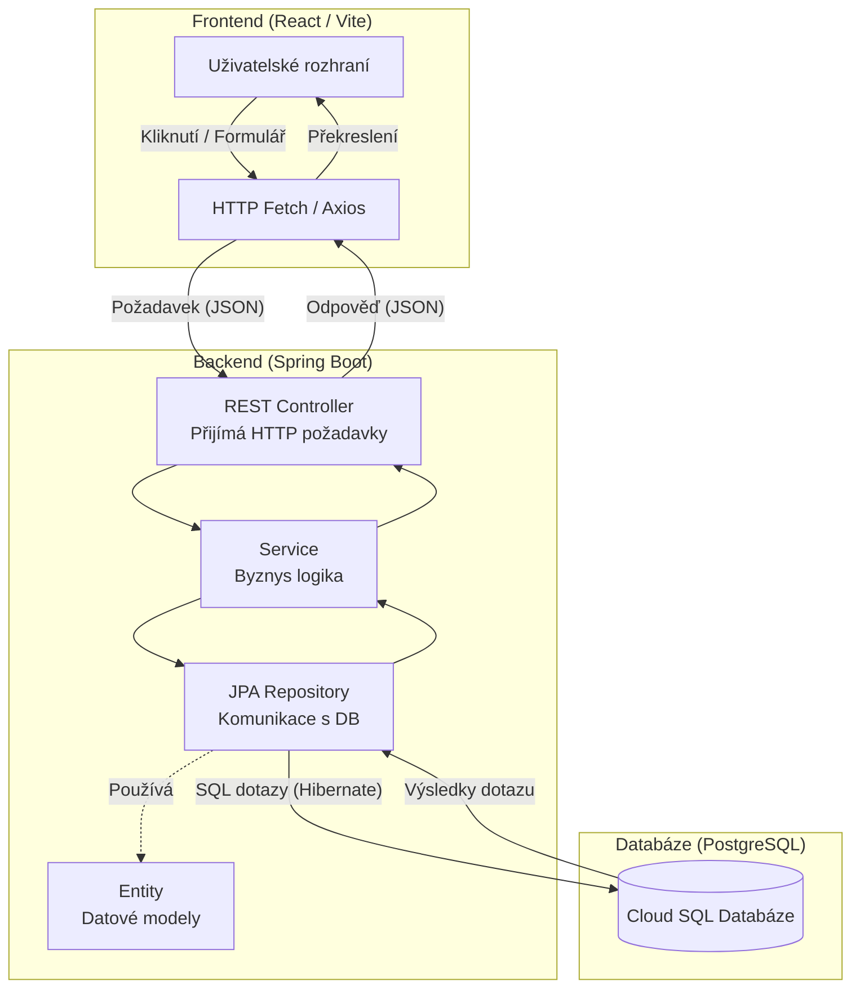
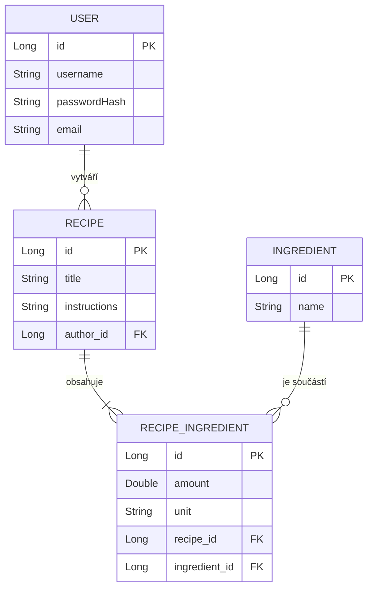

# 📖 Project Receptář

Školní projekt — webová aplikace pro správu receptů. Backend je postaven na frameworku Spring Boot s databází PostgreSQL. Do budoucna se počítá s frontendovým rozhraním v React TypeScript.

---

## 🛠️ Technologie

| Vrstva       | Technologie                      |
|--------------|----------------------------------|
| Backend      | Java 25, Spring Boot 4.0.5       |
| Web          | Spring Web MVC                   |
| Databáze     | PostgreSQL + Spring Data JPA     |
| Validace     | Spring Validation                |
| Build        | Maven                            |
| Utilities    | Lombok, Spring Boot DevTools     |
| Frontend     | React + TypeScript *(plánováno)* |

---

## 📂 Struktura projektu



```
src/
└── main/
    ├── java/cz/osu/projectreceptar/
    │   ├── ProjectReceptarApplication.java   # Vstupní bod aplikace
    │   └── model/
    │       └── entity/
    │           ├── User.java                 # Entita uživatele
    │           ├── Recipe.java               # Entita receptu
    │           ├── Ingredient.java           # Entita ingredience
    │           └── RecipeIngredient.java     # Vazební tabulka recept–ingredience
    └── resources/
        └── application.yaml                  # Konfigurace aplikace
```

---

## 🗄️ Datový model



| Entita            | Popis                                              |
|-------------------|----------------------------------------------------|
| `User`            | Uživatel (username, email, passwordHash)           |
| `Recipe`          | Recept (název, postup, autor)                      |
| `Ingredient`      | Ingredience (název)                                |
| `RecipeIngredient`| Propojení receptu s ingrediencí (množství, jednotka) |

---

## 🚀 Spuštění projektu

### Požadavky

- Java 25+
- Maven 3.9+
- PostgreSQL (lokálně nebo vzdáleně, např. [Neon](https://neon.tech/))

### Konfigurace databáze

Přidejte do `src/main/resources/application.yaml` (nebo jako proměnné prostředí):

```yaml
spring:
  datasource:
    url: jdbc:postgresql://localhost:5432/receptar
    username: <váš_uživatel>
    password: <vaše_heslo>
  jpa:
    hibernate:
      ddl-auto: update
    show-sql: true
```

### Sestavení a spuštění

```bash
# Sestavení projektu
./mvnw clean package

# Spuštění aplikace
./mvnw spring-boot:run
```

Aplikace poběží na `http://localhost:8080`.

---

## ✅ Stav vývoje

- [x] JPA entity (User, Recipe, Ingredient, RecipeIngredient)
- [x] Maven build konfigurace
- [ ] Repository vrstva (Spring Data)
- [ ] Servisní vrstva (business logika)
- [ ] REST API (controllery)
- [ ] Autentizace / autorizace
- [ ] Frontendová aplikace (React TypeScript)

---

## 🧪 Testy

```bash
./mvnw test
```

---

## 👥 Autoři

Jakub Vaca & Radim Bednář — školní projekt, Ostravská univerzita (`cz.osu`)
